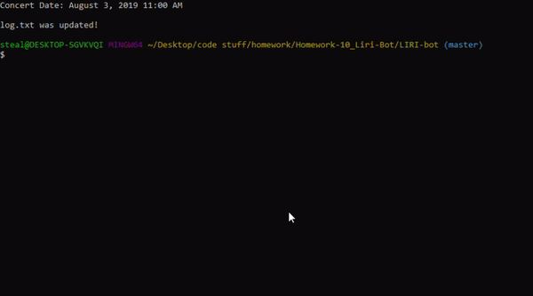
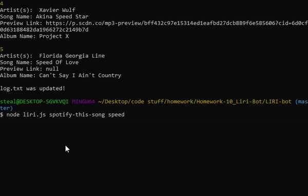
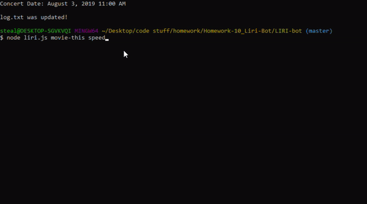
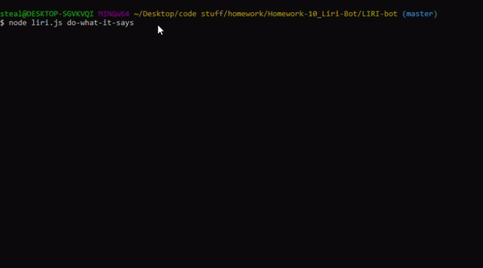

# Liri-Bot

This bot will quickly and easily take in 4 distinct node requests:

1. `node liri.js concert-this <artist/band name here>`

2. `node liri.js spotify-this-song '<song name here>'`

3. `node liri.js movie-this '<movie name here>'`

4. `node liri.js do-what-it-says`

Liri-Bot will then output responses based on users submitted information to both the console and a .txt file labeled “log.txt”  

***

## concert-this

The `concert-this` function will take in a band name from the user and output the nest 10 concerts that band is doing in chronological order.  Listing the:

* `Venue Name`
* `Venue location`
* `Date/Time` 

for the concert. 

***

## spotify-this-song

The `spotify-this-song` function will take in a song name from the user and output the first 5 songs found by the Spotify API.  Listing the:

* `Artist(s) name(s)`
* `Song Name`
* `Preview Link of the song` 
* `Album Name` 

for the song. 

***

## movie-this

The `movie-this` function will take in a movie name from the user and output 8 pieces of info:

* `Movie Title`
* `Release date`
* `IMDB Rating`
* `Rotten Tomatoes Rating`
* `Country made in`
* `Language spoken`
* `A short plot synopsis`
* `Actors involved`

for the movie. 

***

## do-what-it-says

The `do-what-it-says` function will take in information from a txt document labeled `random.txt` in the form of *`function-to-call`*`,`**`”user input”`**. Outputting whatever information is called for in the desired function. 

